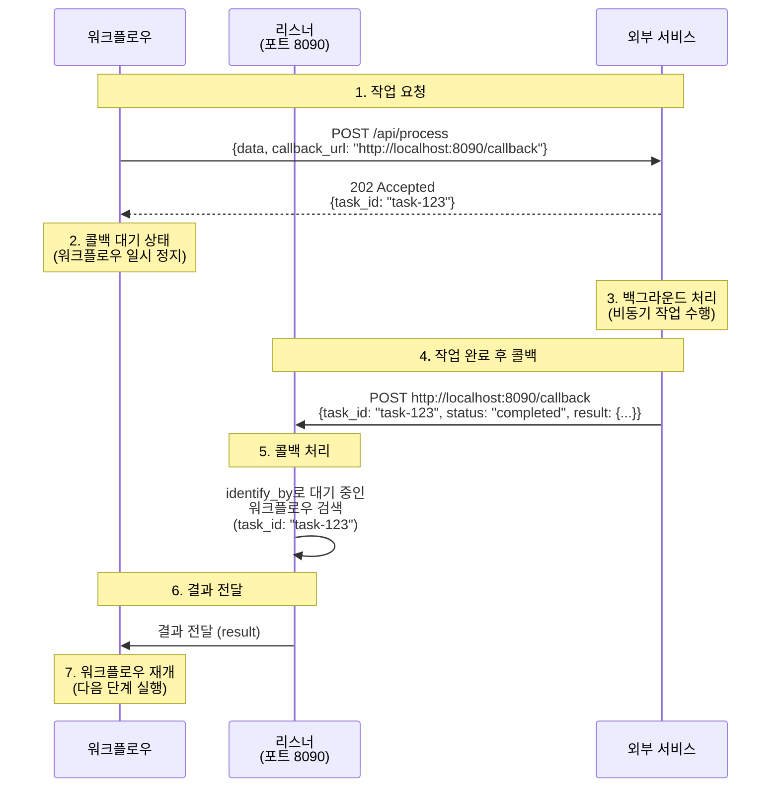
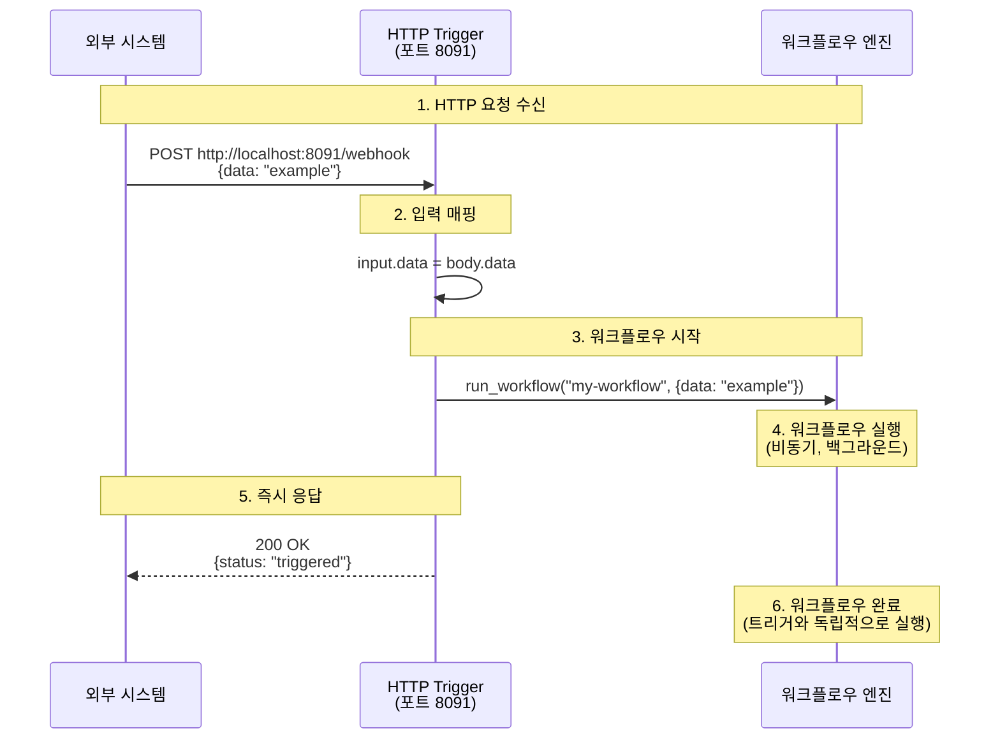
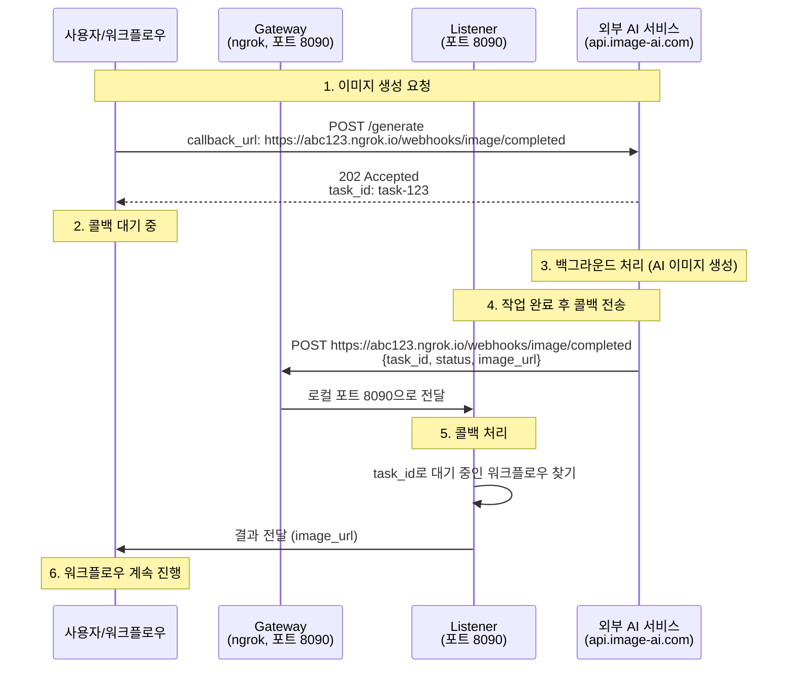

# 15. 시스템 통합

이 장에서는 외부 시스템과 통합하기 위한 리스너와 게이트웨이 기능을 다룹니다.

---

## 15.1 리스너 개요

리스너는 외부 시스템과 통신하기 위한 HTTP 서버입니다. 두 가지 유형이 있습니다:

### 리스너 유형

**1. HTTP Callback (http-callback)**
- 외부 서비스로부터 **비동기 콜백**을 받아 **대기 중인 워크플로우**에 결과 전달
- 용도: 비동기 API 통합 (이미지 생성, 비디오 처리, 결제 처리 등)
- 특징: 워크플로우가 콜백을 기다리며 일시 정지

**2. HTTP Trigger (http-trigger)**
- 외부에서 HTTP 요청을 받아 **즉시 워크플로우 실행**
- 용도: 웹훅 수신, REST API 엔드포인트 제공
- 특징: 요청마다 새로운 워크플로우 인스턴스 시작

### 차이점 비교

| 특징 | HTTP Callback | HTTP Trigger |
|------|--------------|--------------|
| **목적** | 비동기 작업 결과 수신 | 워크플로우 시작 |
| **워크플로우** | 이미 실행 중 (대기 상태) | 새로 시작 |
| **응답** | 대기 중인 워크플로우에 전달 | 즉시 워크플로우 실행 |
| **사용 예** | 외부 API 콜백, 결제 완료 알림 | 웹훅 수신, REST API |
| **식별자** | `identify_by`로 대기 워크플로우 매칭 | 항상 새 워크플로우 시작 |

---

## 15.2 HTTP Callback 리스너

HTTP Callback 리스너는 외부 서비스로부터 비동기 콜백을 받기 위한 서버입니다. 작업 완료 후 결과를 콜백 URL로 전송하는 외부 서비스와 통합할 때 유용합니다.

### 15.2.1 HTTP Callback 개요

많은 외부 서비스는 즉시 결과를 반환하지 않고, 작업을 큐에 넣고 나중에 콜백 URL로 결과를 전송합니다:

1. 클라이언트가 외부 서비스에 작업 요청 (콜백 URL 포함)
2. 외부 서비스가 작업 ID 즉시 반환
3. 외부 서비스가 백그라운드에서 작업 처리
4. 작업 완료 후 콜백 URL로 결과 전송
5. 리스너가 콜백을 받아 대기 중인 요청에 결과 전달

### 15.2.2 HTTP Callback 기본 설정

**간단한 콜백 리스너:**

```yaml
listener:
  type: http-callback
  host: 0.0.0.0
  port: 8090
  path: /callback
  method: POST
```

이 설정은 `http://0.0.0.0:8090/callback` 엔드포인트를 생성하여 POST 요청을 받습니다.

### 15.2.3 콜백 엔드포인트 설정

**단일 콜백 엔드포인트:**

```yaml
listener:
  type: http-callback
  host: 0.0.0.0
  port: 8090
  path: /webhook/completed           # 콜백 경로
  method: POST                       # HTTP 메서드
  identify_by: ${body.task_id}       # 작업 식별자
  status: ${body.status}             # 상태 필드
  success_when:                      # 성공 상태 값
    - "completed"
    - "success"
  fail_when:                         # 실패 상태 값
    - "failed"
    - "error"
  result: ${body.result}             # 결과 추출 경로
```

**다중 콜백 엔드포인트:**

```yaml
listener:
  type: http-callback
  host: 0.0.0.0
  port: 8090
  base_path: /webhooks                # 공통 베이스 경로
  callbacks:
    # 이미지 생성 완료 콜백
    - path: /image/completed
      method: POST
      identify_by: ${body.request_id}
      status: ${body.status}
      success_when: ["completed"]
      fail_when: ["failed"]
      result: ${body.image_url}

    # 비디오 처리 완료 콜백
    - path: /video/completed
      method: POST
      identify_by: ${body.task_id}
      status: ${body.state}
      success_when: ["done"]
      fail_when: ["error", "timeout"]
      result: ${body.output}

    # 일반 작업 완료 콜백
    - path: /task/callback
      method: POST
      identify_by: ${body.id}
      result: ${body.data}
```

### 15.2.4 콜백 필드 설명

| 필드 | 설명 | 필수 | 기본값 |
|------|------|------|--------|
| `path` | 콜백 엔드포인트 경로 | 예 | - |
| `method` | HTTP 메서드 | 아니오 | `POST` |
| `identify_by` | 작업 식별 필드 경로 | 아니오 | `__callback__` |
| `status` | 상태 확인 필드 경로 | 아니오 | - |
| `success_when` | 성공 상태 값 목록 | 아니오 | - |
| `fail_when` | 실패 상태 값 목록 | 아니오 | - |
| `result` | 결과 추출 필드 경로 | 아니오 | 전체 body |
| `bulk` | 단일 요청에 여러 항목 처리 | 아니오 | `false` |
| `item` | bulk 모드에서 항목 추출 경로 | 아니오 | - |

### 15.2.5 벌크(Bulk) 콜백 처리

여러 작업의 결과를 하나의 콜백 요청으로 받는 경우:

```yaml
listener:
  type: http-callback
  host: 0.0.0.0
  port: 8090
  path: /batch/completed
  method: POST
  bulk: true                          # 벌크 모드 활성화
  item: ${body.results}               # 결과 배열 경로
  identify_by: ${item.task_id}        # 각 항목의 식별자
  status: ${item.status}
  success_when: ["completed"]
  result: ${item.data}
```

콜백 요청 예시:
```json
{
  "results": [
    {
      "task_id": "task-1",
      "status": "completed",
      "data": {"url": "https://example.com/result1.png"}
    },
    {
      "task_id": "task-2",
      "status": "completed",
      "data": {"url": "https://example.com/result2.png"}
    }
  ]
}
```

### 15.2.6 HTTP Callback 고급 설정

**동시 실행 제어:**

```yaml
listener:
  type: http-callback
  host: 0.0.0.0
  port: 8090
  max_concurrent_count: 10            # 최대 동시 콜백 처리 수
  path: /callback
  method: POST
```

**런타임 설정:**

```yaml
listener:
  type: http-callback
  runtime: native                     # 또는 docker
  host: 0.0.0.0
  port: 8090
  path: /callback
```

### 15.2.7 HTTP Callback 작동 원리

HTTP Callback 리스너는 외부 서비스로부터 콜백을 받아 대기 중인 워크플로우에 결과를 전달합니다.

**기본 구조:**

```yaml
listener:
  type: http-callback
  host: 0.0.0.0
  port: 8090
  path: /callback
  identify_by: ${body.task_id}        # 어떤 워크플로우인지 식별
  result: ${body.result}              # 결과 추출
```

**워크플로우 실행 흐름:**



**단계별 설명:**

1. **워크플로우 시작**: 외부 서비스에 요청 전송 (콜백 URL 포함)
2. **즉시 응답**: 외부 서비스가 작업 ID 반환
3. **대기 상태**: 워크플로우는 콜백을 기다리며 일시 정지
4. **백그라운드 처리**: 외부 서비스가 비동기로 작업 수행
5. **콜백 전송**: 작업 완료 후 콜백 URL로 결과 전송
6. **리스너 수신**: 리스너가 콜백 수신하여 `identify_by`로 워크플로우 찾기
7. **워크플로우 재개**: 결과를 워크플로우에 전달하고 다음 단계 실행

**중요**: 리스너는 로컬 포트에서만 실행되므로, 외부에서 접근하려면 **게이트웨이**(15.4절)가 필요합니다. 게이트웨이와 함께 사용하는 완전한 예제는 **15.5절**에서 다룹니다.

### 15.2.8 콜백 데이터 매핑

리스너는 콜백 요청의 다양한 필드를 추출하고 매핑할 수 있습니다.

**단일 필드 추출:**

```yaml
listener:
  path: /webhook
  identify_by: ${body.task_id}
  result: ${body.output.url}          # 중첩된 필드 접근
```

**여러 필드 추출:**

```yaml
listener:
  path: /webhook
  identify_by: ${body.task_id}
  result:
    url: ${body.output.url}
    width: ${body.output.width}
    height: ${body.output.height}
    size: ${body.output.file_size}
```

**쿼리 파라미터 사용:**

```yaml
listener:
  path: /webhook
  identify_by: ${query.task_id}       # URL 쿼리에서 추출
  result: ${body}
```

콜백 요청 예시:
```
POST http://localhost:8090/webhook?task_id=task-123
Content-Type: application/json

{
  "status": "completed",
  "output": {
    "url": "https://example.com/result.png"
  }
}
```

---

## 15.3 HTTP Trigger 리스너

HTTP Trigger 리스너는 외부에서 HTTP 요청을 받아 즉시 워크플로우를 실행합니다. REST API 엔드포인트나 웹훅 수신기로 사용할 수 있습니다.

### 15.3.1 HTTP Trigger 개요

HTTP Trigger는 다음과 같은 상황에서 유용합니다:

- 외부 시스템에서 웹훅을 보낼 때 (GitHub, Slack, Discord 등)
- REST API 엔드포인트를 제공할 때
- 수동으로 워크플로우를 트리거할 때
- 이벤트 기반 자동화가 필요할 때

**HTTP Callback과의 차이:**
- HTTP Callback: 이미 실행 중인 워크플로우에 결과 전달
- HTTP Trigger: 새로운 워크플로우 인스턴스 시작

### 15.3.2 HTTP Trigger 기본 설정

**간단한 트리거 리스너:**

```yaml
listener:
  type: http-trigger
  host: 0.0.0.0
  port: 8091
  path: /trigger/my-workflow
  method: POST
  workflow: my-workflow
  input:
    data: ${body.data}
```

이 설정은 `http://0.0.0.0:8091/trigger/my-workflow` 엔드포인트를 생성하여 POST 요청을 받으면 `my-workflow`를 실행합니다.

### 15.3.3 트리거 엔드포인트 설정

**단일 트리거 엔드포인트:**

```yaml
listener:
  type: http-trigger
  host: 0.0.0.0
  port: 8091
  path: /webhooks/deploy
  method: POST
  workflow: deployment-workflow
  input:
    repo: ${body.repository.name}
    branch: ${body.ref}
    commit: ${body.head_commit.id}
```

**다중 트리거 엔드포인트:**

```yaml
listener:
  type: http-trigger
  host: 0.0.0.0
  port: 8091
  base_path: /api
  triggers:
    # GitHub push 이벤트
    - path: /github/push
      method: POST
      workflow: ci-build
      input:
        repository: ${body.repository.name}
        branch: ${body.ref}
        pusher: ${body.pusher.name}

    # Slack 슬래시 커맨드
    - path: /slack/command
      method: POST
      workflow: slack-handler
      input:
        command: ${body.command}
        text: ${body.text}
        user: ${body.user_name}
        channel: ${body.channel_id}

    # 수동 트리거
    - path: /manual/process
      method: POST
      workflow: data-processing
      input:
        file_url: ${body.file_url}
        options: ${body.options}
```

### 15.3.4 트리거 필드 설명

| 필드 | 설명 | 필수 | 기본값 |
|------|------|------|--------|
| `path` | 트리거 엔드포인트 경로 | 예 | - |
| `method` | HTTP 메서드 | 아니오 | `POST` |
| `workflow` | 실행할 워크플로우 ID | 예 | - |
| `input` | 워크플로우 입력 매핑 | 아니오 | 전체 body |
| `bulk` | 단일 요청에 여러 워크플로우 실행 | 아니오 | `false` |
| `item` | bulk 모드에서 항목 추출 경로 | 아니오 | - |

### 15.3.5 벌크(Bulk) 트리거 처리

여러 항목을 한 번에 처리하여 각각 워크플로우를 실행하는 경우:

```yaml
listener:
  type: http-trigger
  host: 0.0.0.0
  port: 8091
  path: /batch/process
  method: POST
  bulk: true
  item: ${body.items}
  workflow: item-processor
  input:
    item_id: ${item.id}
    data: ${item.data}
```

요청 예시:
```json
{
  "items": [
    {"id": "item-1", "data": {"name": "Product A"}},
    {"id": "item-2", "data": {"name": "Product B"}},
    {"id": "item-3", "data": {"name": "Product C"}}
  ]
}
```

이 요청은 3개의 워크플로우 인스턴스를 각각 실행합니다.

### 15.3.6 HTTP Trigger 작동 원리

**기본 구조:**

```yaml
listener:
  type: http-trigger
  port: 8091
  path: /webhook
  workflow: my-workflow
  input:
    data: ${body.data}
```

**실행 흐름:**



**단계별 설명:**

1. **요청 수신**: 외부 시스템이 트리거 엔드포인트에 HTTP 요청 전송
2. **입력 매핑**: `input` 설정에 따라 요청 데이터를 워크플로우 입력으로 변환
3. **워크플로우 시작**: 새로운 워크플로우 인스턴스를 비동기로 시작
4. **즉시 응답**: 워크플로우 완료를 기다리지 않고 즉시 응답 반환
5. **백그라운드 실행**: 워크플로우는 독립적으로 실행 완료

**중요**: HTTP Trigger는 워크플로우를 시작만 하고 즉시 응답을 반환합니다. 워크플로우 결과를 받으려면 별도의 메커니즘(HTTP Callback, 데이터베이스 조회 등)이 필요합니다.

### 15.3.7 입력 데이터 매핑

HTTP 요청의 다양한 필드를 워크플로우 입력으로 매핑할 수 있습니다.

**Body 필드 추출:**

```yaml
listener:
  type: http-trigger
  path: /webhook
  workflow: my-workflow
  input:
    name: ${body.user.name}
    email: ${body.user.email}
    action: ${body.action}
```

**Query 파라미터 사용:**

```yaml
listener:
  type: http-trigger
  path: /webhook
  workflow: my-workflow
  input:
    token: ${query.token}
    mode: ${query.mode}
    data: ${body}
```

요청 예시:
```
POST http://localhost:8091/webhook?token=abc123&mode=test
Content-Type: application/json

{
  "user": "john",
  "action": "process"
}
```

**복합 매핑:**

```yaml
listener:
  type: http-trigger
  path: /webhook
  workflow: my-workflow
  input:
    auth:
      token: ${query.token}
      user: ${body.user}
    payload:
      data: ${body.data}
      timestamp: ${body.timestamp}
```

### 15.3.8 실전 예제

**GitHub Webhook 처리:**

```yaml
listener:
  type: http-trigger
  host: 0.0.0.0
  port: 8091
  path: /github/webhook
  method: POST
  workflow: github-ci
  input:
    event: ${body.action}
    repository: ${body.repository.full_name}
    branch: ${body.pull_request.head.ref}
    author: ${body.pull_request.user.login}

workflow:
  id: github-ci
  title: GitHub CI Pipeline
  jobs:
    - id: checkout
      component: git-clone
      input:
        repo: ${input.repository}
        branch: ${input.branch}

    - id: test
      component: run-tests
      depends_on: [checkout]

    - id: notify
      component: github-status
      depends_on: [test]
      input:
        status: ${jobs.test.output.success}
```

**Slack Webhook 처리:**

```yaml
listener:
  type: http-trigger
  host: 0.0.0.0
  port: 8091
  path: /slack/events
  method: POST
  workflow: slack-bot
  input:
    event_type: ${body.event.type}
    user: ${body.event.user}
    channel: ${body.event.channel}
    text: ${body.event.text}

workflow:
  id: slack-bot
  title: Slack Bot Handler
  jobs:
    - id: process-message
      component: nlp-analyzer
      input:
        text: ${input.text}

    - id: reply
      component: slack-client
      depends_on: [process-message]
      input:
        channel: ${input.channel}
        text: "처리 완료: ${jobs.process-message.output.result}"
```

---

## 15.4 게이트웨이 - HTTP 터널링

게이트웨이는 로컬에서 실행 중인 서비스를 인터넷에 공개하기 위한 터널링 서비스입니다. 개발 환경에서 웹훅을 테스트하거나 외부에서 로컬 서비스에 접근해야 할 때 유용합니다.

### 15.4.1 게이트웨이 개요

게이트웨이는 다음과 같은 상황에서 필요합니다:

- 로컬 개발 환경에서 외부 웹훅 테스트
- 방화벽 뒤의 서비스를 외부에 공개
- 임시 공개 URL이 필요한 경우
- 외부 서비스가 콜백 URL을 요구하는 경우

**지원 게이트웨이:**

| 타입 | 특징 | 사용 사례 |
|------|------|----------|
| **HTTP 터널 (ngrok)** | 쉬운 설정, 임시 URL | 로컬 개발, 빠른 테스트 |
| **HTTP 터널 (Cloudflare)** | 무료 무제한, 높은 안정성 | 로컬 개발, 지속적 테스트 |
| **SSH 터널** | 자체 서버 사용, 고정 주소 | 기업 환경, 프로덕션 준비 |

### 15.4.2 HTTP 터널 - ngrok

ngrok는 로컬 서버를 공개 URL로 노출하는 터널링 서비스입니다.

**기본 설정 (단일 포트):**

```yaml
gateway:
  type: http-tunnel
  driver: ngrok
  port: 8080  # 터널링할 로컬 포트
```

이 설정은 로컬 포트 8080을 ngrok 공개 URL로 노출합니다.

**다중 포트 설정:**

```yaml
gateway:
  type: http-tunnel
  driver: ngrok
  port:
    - 8080  # 첫 번째 로컬 포트
    - 8090  # 두 번째 로컬 포트
    - 3000  # 세 번째 로컬 포트
```

각 포트는 고유한 공개 URL을 받습니다 (예: `https://abc123.ngrok.io`, `https://def456.ngrok.io`, `https://ghi789.ngrok.io`).

**단일 포트 전체 예제:**

```yaml
gateway:
  type: http-tunnel
  driver: ngrok
  port: 8090  # 리스너 포트와 동일

listener:
  type: http-callback
  host: 0.0.0.0
  port: 8090
  path: /callback
  identify_by: ${body.task_id}
  result: ${body.result}

components:
  external-service:
    type: http-client
    base_url: https://api.external-service.com
    action:
      path: /process
      method: POST
      body:
        data: ${input.data}
        # gateway:8090.public_url을 사용하여 공개 URL 접근
        callback_url: ${gateway:8090.public_url}/callback
        callback_id: ${context.run_id}
      output: ${response}

workflow:
  title: External Service with Gateway
  jobs:
    - id: process
      component: external-service
      input: ${input}
      output: ${output}
```

**다중 포트 사용 예제:**

```yaml
gateway:
  type: http-tunnel
  driver: ngrok
  port:
    - 8090  # 콜백 리스너
    - 8091  # 상태 웹훅
    - 8092  # 관리자 인터페이스

components:
  external-service:
    type: http-client
    base_url: https://api.external-service.com
    action:
      path: /process
      method: POST
      body:
        data: ${input.data}
        callback_url: ${gateway:8090.public_url}/callback
        status_url: ${gateway:8091.public_url}/status
        admin_url: ${gateway:8092.public_url}/admin
      output: ${response}
```

**게이트웨이 URL 접근:**

`${gateway:PORT.public_url}` 형식으로 각 노출된 포트의 공개 URL을 제공합니다:
- `${gateway:8090.public_url}` → `https://abc123.ngrok.io`
- `${gateway:8091.public_url}` → `https://def456.ngrok.io`
- `${gateway:8092.public_url}` → `https://ghi789.ngrok.io`

**실행 흐름:**
1. 게이트웨이 시작: ngrok가 로컬 포트를 공개 URL로 노출
2. 리스너 시작: 설정된 포트에서 콜백 대기
3. 워크플로우 실행: `${gateway:PORT.public_url}`이 실제 공개 URL로 치환됨
4. 외부 서비스에 콜백 URL 전달
5. 외부 서비스가 작업 완료 후 공개 URL로 콜백 전송
6. ngrok가 요청을 해당 로컬 포트로 전달
7. 리스너가 콜백 수신 후 워크플로우에 결과 전달

### 15.4.3 HTTP 터널 - Cloudflare

Cloudflare Tunnel (이전 Argo Tunnel)은 무제한 대역폭으로 무료 사용 가능한 안정적인 터널링 서비스입니다.

**기본 설정 (단일 포트):**

```yaml
gateway:
  type: http-tunnel
  driver: cloudflare
  port: 8080  # 터널링할 로컬 포트
```

이 설정은 로컬 포트 8080을 Cloudflare Tunnel 공개 URL로 노출합니다.

**다중 포트 설정:**

```yaml
gateway:
  type: http-tunnel
  driver: cloudflare
  port:
    - 8080  # 첫 번째 로컬 포트
    - 8090  # 두 번째 로컬 포트
    - 3000  # 세 번째 로컬 포트
```

각 포트는 고유한 공개 URL을 받습니다 (예: `https://abc-def.trycloudflare.com`, `https://ghi-jkl.trycloudflare.com`, `https://mno-pqr.trycloudflare.com`).

**콜백과 함께 사용하는 전체 예제:**

```yaml
gateway:
  type: http-tunnel
  driver: cloudflare
  port: 8090

listener:
  type: http-callback
  host: 0.0.0.0
  port: 8090
  path: /callback
  identify_by: ${body.task_id}
  result: ${body.result}

components:
  external-service:
    type: http-client
    base_url: https://api.external-service.com
    action:
      path: /process
      method: POST
      body:
        data: ${input.data}
        # gateway:8090.public_url을 사용하여 공개 URL 접근
        callback_url: ${gateway:8090.public_url}/callback
        callback_id: ${context.run_id}
      output: ${response}
```

**다중 포트 사용 예제:**

```yaml
gateway:
  type: http-tunnel
  driver: cloudflare
  port:
    - 8090  # 콜백 리스너
    - 8091  # 상태 웹훅
    - 3000  # 프론트엔드 애플리케이션

components:
  external-service:
    type: http-client
    base_url: https://api.external-service.com
    action:
      path: /process
      method: POST
      body:
        data: ${input.data}
        callback_url: ${gateway:8090.public_url}/callback
        status_url: ${gateway:8091.public_url}/status
        app_url: ${gateway:3000.public_url}
      output: ${response}
```

**게이트웨이 URL 접근:**

`${gateway:PORT.public_url}` 형식으로 각 노출된 포트의 공개 URL을 제공합니다:
- `${gateway:8090.public_url}` → `https://abc-def.trycloudflare.com`
- `${gateway:8091.public_url}` → `https://ghi-jkl.trycloudflare.com`
- `${gateway:3000.public_url}` → `https://mno-pqr.trycloudflare.com`

**ngrok vs Cloudflare 비교:**

| 특징 | ngrok | Cloudflare |
|------|-------|------------|
| 무료 플랜 | 제한적 (시간당 요청 수 제한) | 무제한 |
| 설정 난이도 | 쉬움 | 중간 (계정 필요) |
| URL 형식 | `https://random.ngrok.io` | `https://random.trycloudflare.com` |
| 안정성 | 높음 | 매우 높음 |
| 속도 | 빠름 | 매우 빠름 |
| URL 수명 | 세션 기반 | 세션 기반 |

### 15.4.4 SSH 터널

SSH 리버스 터널을 사용하여 원격 서버를 통해 로컬 서비스를 공개합니다.

**SSH 키 인증:**

```yaml
gateway:
  type: ssh-tunnel
  port:
    - "9834:8090"  # 원격 포트 9834 -> 로컬 포트 8090
  connection:
    host: remote-server.com
    port: 22
    auth:
      type: keyfile
      username: user
      keyfile: ~/.ssh/id_rsa
```

**SSH 비밀번호 인증:**

```yaml
gateway:
  type: ssh-tunnel
  port:
    - "9834:8090"  # 원격 포트 9834 -> 로컬 포트 8090
  connection:
    host: remote-server.com
    port: 22
    auth:
      type: password
      username: user
      password: ${env.SSH_PASSWORD}
```

**포트 포워딩 형식:**

`port` 필드는 다양한 유연한 형식을 지원합니다:

1. **정수**: `8090` → 원격 포트 8090을 localhost:8090으로 포워딩
2. **포트:포트**: `"9834:8090"` → 원격 포트 9834를 localhost:8090으로 포워딩
3. **포트:호스트**: `"8090:192.168.1.107"` → 원격 포트 8090을 192.168.1.107:8090으로 포워딩
4. **포트:호스트:포트**: `"9834:192.168.1.107:3000"` → 원격 포트 9834를 192.168.1.107:3000으로 포워딩

**다중 포트 포워딩:**

```yaml
gateway:
  type: ssh-tunnel
  port:
    - "9834:8090"  # 원격 9834 -> localhost:8090
    - "9835:8091"  # 원격 9835 -> localhost:8091
    - "9836:8092"  # 원격 9836 -> localhost:8092
  connection:
    host: remote-server.com
    port: 22
    auth:
      type: keyfile
      username: user
      keyfile: ~/.ssh/id_rsa
```

**로컬 네트워크의 다른 호스트로 포워딩:**

```yaml
gateway:
  type: ssh-tunnel
  port:
    - "8080:192.168.1.107"          # 원격 8080 -> 192.168.1.107:8080
    - "9834:192.168.1.107:3000"     # 원격 9834 -> 192.168.1.107:3000
    - "9835:example.local:8090"     # 원격 9835 -> example.local:8090
  connection:
    host: remote-server.com
    port: 22
    auth:
      type: keyfile
      username: user
      keyfile: ~/.ssh/id_rsa
```

로컬 네트워크의 다른 머신에서 실행 중인 서비스를 노출할 때 유용합니다.

**간단한 포트 설정 (로컬과 원격 포트 동일):**

```yaml
gateway:
  type: ssh-tunnel
  port: 8090  # 원격 포트 8090 -> localhost:8090
  connection:
    host: remote-server.com
    port: 22
    auth:
      type: keyfile
      username: user
      keyfile: ~/.ssh/id_rsa
```

SSH 터널은 다음과 같은 경우에 유용합니다:
- 자체 도메인을 사용하고 싶을 때
- 방화벽이 ngrok/Cloudflare를 차단할 때
- 기업 환경에서 승인된 서버만 사용해야 할 때
- 고정된 IP 주소나 포트가 필요할 때
- 로컬 네트워크의 다른 머신에 있는 서비스를 노출할 때

### 15.4.5 게이트웨이 고급 설정

**런타임 설정:**

```yaml
gateway:
  type: http-tunnel
  driver: ngrok
  runtime: native                     # 또는 docker
  port: 8080
```

**게이트웨이 변수 사용:**

게이트웨이가 설정되면 다음 변수를 사용할 수 있습니다:

**HTTP 터널 (ngrok, Cloudflare):**

```yaml
gateway:
  type: http-tunnel
  driver: ngrok
  port: 8080

components:
  service:
    type: http-client
    action:
      body:
        # 공개 URL 사용 (gateway:포트.public_url 형식)
        webhook_url: ${gateway:8080.public_url}/webhook
        # 예: https://abc123.ngrok.io/webhook

        # 포트 정보
        local_port: ${gateway:8080.port}
```

**SSH 터널:**

```yaml
gateway:
  type: ssh-tunnel
  port:
    - "9834:8090"
  connection:
    host: remote-server.com
    port: 22
    auth:
      type: keyfile
      username: user
      keyfile: ~/.ssh/id_rsa

components:
  service:
    type: http-client
    action:
      body:
        # 공개 주소 사용 (gateway:로컬포트.public_address 형식)
        webhook_url: http://${gateway:8090.public_address}/webhook
        # 예: http://remote-server.com:9834/webhook
```

### 15.4.6 실전 예제: SSH 터널 사용

**SSH 터널을 통한 콜백 수신:**

```yaml
gateway:
  type: ssh-tunnel
  port:
    - "9834:8090"  # 원격 포트 9834 -> 로컬 포트 8090
  connection:
    host: ${env.SSH_TUNNEL_HOST}
    port: ${env.SSH_TUNNEL_PORT | 22}
    auth:
      type: keyfile
      username: ${env.SSH_USERNAME}
      keyfile: ${env.SSH_KEYFILE | ~/.ssh/id_rsa}

listener:
  type: http-callback
  host: 0.0.0.0
  port: 8090
  path: /callback
  identify_by: ${body.task_id}
  result: ${body.result}

component:
  type: http-client
  base_url: https://api.external-service.com
  action:
    path: /process
    method: POST
    headers:
      Content-Type: application/json
    body:
      data: ${input.data}
      # SSH 터널의 공개 주소 사용
      callback_url: http://${gateway:8090.public_address}/callback
      task_id: ${context.run_id}
    output:
      task_id: ${response.task_id}
      result: ${result as json}
  completion:
    type: callback
    wait_for: ${context.run_id}

workflow:
  title: SSH Tunnel Gateway Example
  description: SSH 터널을 사용하여 로컬 콜백 리스너를 외부 서비스에 노출
  input: ${input}
  output: ${output}
```

**환경 변수 설정:**

```bash
export SSH_TUNNEL_HOST="remote-server.com"
export SSH_TUNNEL_PORT=22
export SSH_USERNAME="user"
export SSH_KEYFILE="~/.ssh/id_rsa"

model-compose up
```

이 설정은 다음과 같이 작동합니다:
1. 로컬 포트 8090에서 리스너 실행
2. SSH 터널을 통해 원격 서버의 포트 9834를 로컬 포트 8090으로 포워딩
3. 외부 서비스는 `http://remote-server.com:9834/callback`으로 콜백 전송
4. SSH 터널이 요청을 로컬 포트 8090으로 전달
5. 리스너가 콜백을 수신하여 워크플로우에 결과 전달

### 15.4.7 실전 예제: Slack 봇 웹훅

```yaml
gateway:
  type: http-tunnel
  driver: cloudflare
  port: 8090  # 리스너 포트와 동일

listener:
  type: http-callback
  host: 0.0.0.0
  port: 8090
  base_path: /slack
  callbacks:
    - path: /events
      method: POST
      identify_by: ${body.event.client_msg_id}
      result: ${body.event}

components:
  slack-responder:
    type: http-client
    base_url: https://slack.com/api
    action:
      path: /chat.postMessage
      method: POST
      headers:
        Authorization: Bearer ${env.SLACK_BOT_TOKEN}
        Content-Type: application/json
      body:
        channel: ${input.channel}
        text: ${input.text}
      output: ${response}

workflow:
  title: Slack Event Handler
  jobs:
    - id: respond
      component: slack-responder
      input:
        channel: ${input.event.channel}
        text: "처리 완료: ${input.event.text}"
      output: ${output}
```

Slack 앱 설정:
1. Slack 앱 생성 (https://api.slack.com/apps)
2. `model-compose up` 실행 후 게이트웨이 로그에서 공개 URL 확인
3. Event Subscriptions 활성화
4. Request URL에 게이트웨이 공개 URL + 리스너 경로 입력 (예: `https://abc123.trycloudflare.com/slack/events`)
5. 봇 토큰 발급 및 `SLACK_BOT_TOKEN` 환경 변수 설정

---

## 15.5 리스너와 게이트웨이 함께 사용

리스너와 게이트웨이를 함께 사용하면 로컬 환경에서도 외부 웹훅을 안전하게 테스트할 수 있습니다.

### 15.5.1 통합 예제: 비동기 이미지 처리

```yaml
gateway:
  type: http-tunnel
  driver: ngrok
  port: 8090  # 리스너 포트와 동일

listener:
  type: http-callback
  host: 0.0.0.0
  port: 8090
  base_path: /webhooks
  max_concurrent_count: 5
  callbacks:
    - path: /image/completed
      method: POST
      identify_by: ${body.task_id}
      status: ${body.status}
      success_when: ["completed", "success"]
      fail_when: ["failed", "error"]
      result:
        url: ${body.output.url}
        width: ${body.output.width}
        height: ${body.output.height}

components:
  image-generator:
    type: http-client
    base_url: https://api.image-ai.com/v1
    action:
      path: /generate
      method: POST
      headers:
        Authorization: Bearer ${env.IMAGE_AI_KEY}
      body:
        prompt: ${input.prompt}
        size: ${input.size | "1024x1024"}
        # 게이트웨이 공개 URL + 리스너 경로
        callback_url: ${gateway:8090.public_url}/webhooks/image/completed
        task_id: ${context.run_id}
      output:
        task_id: ${response.task_id}
        status: ${response.status}

  image-optimizer:
    type: http-client
    base_url: https://api.imageoptim.com
    action:
      path: /optimize
      method: POST
      headers:
        Authorization: Bearer ${env.IMAGEOPTIM_KEY}
      body:
        url: ${input.url}
        quality: 85
      output:
        optimized_url: ${response.url}
        original_size: ${response.original_size}
        compressed_size: ${response.compressed_size}

workflow:
  title: Image Generation and Optimization
  description: Generate image with AI and optimize it
  jobs:
    # 1단계: AI 이미지 생성 (비동기)
    - id: generate
      component: image-generator
      input:
        prompt: ${input.prompt}
        size: ${input.size}
      output:
        task_id: ${output.task_id}
        image_url: ${output.url}  # 콜백에서 받은 URL
        width: ${output.width}
        height: ${output.height}

    # 2단계: 이미지 최적화 (동기)
    - id: optimize
      component: image-optimizer
      input:
        url: ${jobs.generate.output.image_url}
      output:
        final_url: ${output.optimized_url}
        original_size: ${output.original_size}
        compressed_size: ${output.compressed_size}
        savings: ${output.original_size - output.compressed_size}
```

### 15.5.2 아키텍처 다이어그램



**흐름 설명:**

1. **요청 단계**: 워크플로우가 외부 AI 서비스에 이미지 생성 요청 (게이트웨이 공개 URL을 콜백 URL로 전달)
2. **대기 단계**: 워크플로우는 콜백을 받을 때까지 대기
3. **처리 단계**: 외부 서비스가 백그라운드에서 이미지 생성
4. **콜백 단계**: 완료 후 게이트웨이 공개 URL로 콜백 전송 → 게이트웨이가 로컬 리스너로 전달
5. **매칭 단계**: 리스너가 task_id로 대기 중인 워크플로우 찾기
6. **완료 단계**: 워크플로우에 결과 전달 및 다음 단계 진행

### 15.5.3 프로덕션 환경 고려사항

**로컬 개발:**
```yaml
gateway:
  type: http-tunnel
  driver: ngrok  # 개발 중에는 ngrok 사용
  port: 8080

listener:
  host: 0.0.0.0
  port: 8090
```

**프로덕션 환경:**
```yaml
# gateway 설정 제거 (공인 IP/도메인 사용)

controller:
  type: http-server
  host: 0.0.0.0
  port: 443  # HTTPS
  # SSL 설정 추가

listener:
  host: 0.0.0.0
  port: 8090

components:
  service:
    action:
      body:
        # 프로덕션 도메인 사용
        callback_url: https://api.yourdomain.com/webhooks/callback
        callback_id: ${listener.id}
```

---

## 15.6 시스템 통합 모범 사례

### 1. 리스너 보안

**타임아웃 설정:**

비동기 작업이 무한정 대기하지 않도록 타임아웃을 설정하세요:

```yaml
components:
  service:
    type: http-client
    timeout: 300000  # 5분 타임아웃
    action:
      body:
        callback_url: ${listener.url}
```

**서명 검증:**

콜백 요청의 진위를 확인하기 위해 서명을 검증하세요:

```yaml
listener:
  callbacks:
    - path: /webhook
      # 서명 검증은 커스텀 로직으로 구현 필요
      identify_by: ${body.id}
      # 헤더의 서명 확인: ${header.X-Signature}
```

### 2. 게이트웨이 사용

**개발 환경에서만 사용:**

게이트웨이는 주로 개발/테스트 환경에서 사용하세요. 프로덕션에서는 공인 IP/도메인을 사용하는 것이 좋습니다.

**무료 플랜 제약:**

- ngrok 무료 플랜: 동시 연결 수 제한, 시간당 요청 수 제한
- Cloudflare: 무료 플랜은 제한 없음

### 3. 에러 처리

**콜백 실패 처리:**

```yaml
workflow:
  jobs:
    - id: async-task
      component: async-service
      input: ${input}
      on_error:
        - id: retry
          component: async-service
          input: ${input}
          retry:
            max_retry_count: 3
            delay: 5000
```

**재시도 로직:**

외부 서비스가 콜백 전송에 실패할 수 있으므로 재시도 로직을 구현하세요.

### 4. 로깅 및 모니터링

**콜백 로깅:**

디버깅과 문제 해결을 위해 콜백 요청의 모든 정보를 저장합니다:

```yaml
listener:
  callbacks:
    - path: /webhook
      identify_by: ${body.task_id}
      result:
        task_id: ${body.task_id}      # 작업 식별자
        status: ${body.status}        # 작업 상태
        timestamp: ${body.timestamp}  # 콜백 수신 시간
        data: ${body}                 # 전체 페이로드 저장 (디버깅용)
```

이렇게 저장된 정보는 다음과 같은 목적으로 활용됩니다:
- 콜백 실패 시 원인 분석
- 외부 서비스 응답 시간 모니터링
- 데이터 무결성 검증
- 감사(audit) 로그 생성

**워크플로우 실행 추적:**

각 워크플로우 실행의 전체 흐름을 추적합니다:

```yaml
workflow:
  jobs:
    - id: request
      component: external-api
      input: ${input}
      output:
        request_time: ${context.timestamp}
        task_id: ${output.task_id}

    - id: log-request
      component: logger
      input:
        level: info
        message: "작업 요청: task_id=${jobs.request.output.task_id}"
        data: ${jobs.request.output}

    # 콜백 대기 및 결과 수신

    - id: log-result
      component: logger
      input:
        level: info
        message: "작업 완료: task_id=${jobs.request.output.task_id}"
        data: ${output}
```

**게이트웨이 URL 확인:**

게이트웨이 시작 후 공개 URL을 확인하고 기록합니다:

```bash
model-compose up
# 로그에서 게이트웨이 URL 확인
# [Gateway] Public URL: https://abc123.ngrok.io

# 공개 URL을 외부 서비스에 등록
# 예: Slack Event Subscriptions, GitHub Webhooks 등
```

게이트웨이가 시작될 때마다 새로운 URL이 생성될 수 있으므로, 자동화된 배포 스크립트에서 URL을 추출하여 외부 서비스에 자동 등록하는 것을 권장합니다.

**성능 메트릭 수집:**

```yaml
listener:
  callbacks:
    - path: /webhook
      identify_by: ${body.task_id}
      result:
        task_id: ${body.task_id}                       # 작업 ID
        result: ${body.result}                         # 실제 결과 데이터
        metrics:
          processing_time: ${body.processing_time_ms}  # 실제 처리 시간 (ms)
          queue_time: ${body.queue_time_ms}            # 큐 대기 시간 (ms)
```

이 메트릭을 사용하여:
- 외부 서비스의 평균 처리 시간 계산
- 성능 저하 감지 및 알림
- SLA(Service Level Agreement) 준수 모니터링

---

## 15.7 시스템 - 인프라 관리

시스템은 컴포넌트가 의존하는 인프라 서비스(예: Docker Compose 스택)를 선언적으로 관리합니다. `model-compose up` 실행 시 시스템이 컴포넌트보다 먼저 자동으로 시작되고, `model-compose down` 실행 시 컴포넌트 이후에 자동으로 중지됩니다.

### 15.7.1 시스템 개요

컴포넌트가 외부 인프라를 필요로 할 때 시스템이 유용합니다:

- 데이터베이스 서버 (PostgreSQL, Redis 등)
- 브라우저 자동화 (Chromium + noVNC)
- 메시지 큐 (RabbitMQ, Kafka 등)
- Docker Compose 파일에 정의된 모든 서비스

시스템 없이는 model-compose를 시작하기 전에 수동으로 `docker compose up -d`를 실행해야 합니다. 시스템을 사용하면 이 과정이 자동으로 처리됩니다.

### 15.7.2 Docker Compose 시스템

`docker-compose` 시스템 타입은 Docker Compose 파일에 정의된 서비스를 관리합니다.

**기본 설정:**

```yaml
system:
  type: docker-compose
  file: docker-compose.yml
  wait: true
  wait_timeout: 60s
```

시작 시 `docker compose -f docker-compose.yml up -d --wait`를 실행하고, 종료 시 `docker compose -f docker-compose.yml down`을 실행합니다.

**설정 옵션:**

| 필드 | 타입 | 기본값 | 설명 |
|------|------|--------|------|
| `type` | string | **필수** | `docker-compose` |
| `file` | string | - | docker-compose 파일 경로 (단일) |
| `files` | array | `[]` | docker-compose 파일 경로 (복수) |
| `project_name` | string | - | Docker Compose 프로젝트 이름 (`-p` 플래그) |
| `profiles` | array | - | 활성화할 Docker Compose 프로필 |
| `env_file` | string | - | 환경 변수 파일 경로 |
| `build` | boolean | `false` | 시작 전 이미지 빌드 (`--build`) |
| `wait` | boolean | `true` | 서비스 헬스 체크 대기 (`--wait`) |
| `wait_timeout` | string | `60s` | 헬스 체크 대기 타임아웃 |

### 15.7.3 복수 시스템

서로 다른 인프라 스택이 필요할 때 여러 시스템을 정의할 수 있습니다:

```yaml
systems:
  - id: database
    type: docker-compose
    file: docker-compose.db.yml
    wait: true

  - id: browser-infra
    type: docker-compose
    file: docker-compose.browser.yml
    wait: true
    wait_timeout: 120s
```

### 15.7.4 전체 예제: 브라우저 자동화

시스템과 컴포넌트를 통합하여 브라우저 작업을 자동화하는 예제입니다:

```yaml
systems:
  - id: browser-infra
    type: docker-compose
    file: docker-compose.yml
    wait: true
    wait_timeout: 60s

components:
  - id: browser
    type: web-browser
    host: localhost
    port: 9222
    actions:
      - id: navigate
        method: navigate
        url: "${input.url}"
        wait_until: networkidle

      - id: extract-text
        method: extract
        selector: "${input.selector}"
        extract_mode: text

workflows:
  - id: scrape
    title: 웹 스크래퍼
    input:
      - id: url
        type: string
      - id: selector
        type: string
    jobs:
      - id: navigate
        component: browser
        action: navigate
        input:
          url: ${input.url}

      - id: extract
        component: browser
        action: extract-text
        input:
          selector: ${input.selector}
        depends_on: [navigate]
```

**`model-compose up` 실행 시:**

1. 시스템 `browser-infra` 시작: `docker compose up -d --wait`
2. Docker Compose가 Chromium과 noVNC 컨테이너 시작
3. model-compose가 컨테이너 헬스 체크 완료까지 대기
4. 컴포넌트 `browser`가 포트 9222의 Chromium에 연결
5. 컨트롤러가 워크플로우 요청 수신 시작

**`model-compose down` 실행 시:**

1. 컨트롤러 중지
2. 컴포넌트 `browser` 연결 해제
3. 시스템 `browser-infra` 중지: `docker compose down`

### 15.7.5 라이프사이클 순서

시스템은 다른 섹션과 특정 순서로 실행됩니다:

```
시작: 시스템 → 게이트웨이 → 리스너 → 컴포넌트 → 컨트롤러
종료: 컨트롤러 → 컴포넌트 → 리스너 → 게이트웨이 → 시스템
```

시스템은 다른 섹션이 의존하는 인프라를 제공하므로 가장 먼저 시작되고, 안전한 종료를 위해 가장 마지막에 중지됩니다.

### 15.7.6 전제 조건

- **Docker**가 설치되어 PATH에 있어야 합니다
- **Docker Compose** 플러그인이 사용 가능해야 합니다 (`docker compose` 서브커맨드)

---

## 다음 단계

실습해보세요:
- 외부 비동기 API 통합
- 로컬 환경에서 웹훅 테스트
- Slack/Discord 봇 개발
- 결제 게이트웨이 웹훅 처리
- Docker Compose 시스템을 활용한 브라우저 자동화

---

**다음 장**: [16. 배포](/model-compose/ko/user-guide/16-deployment.md)
