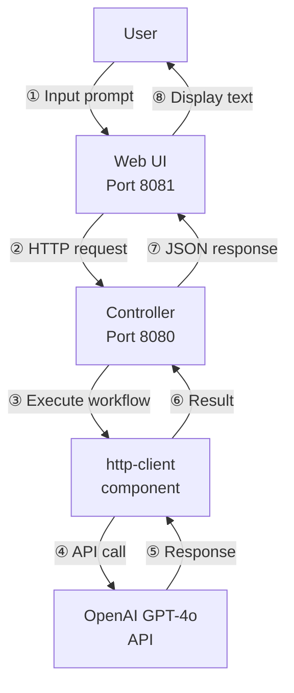
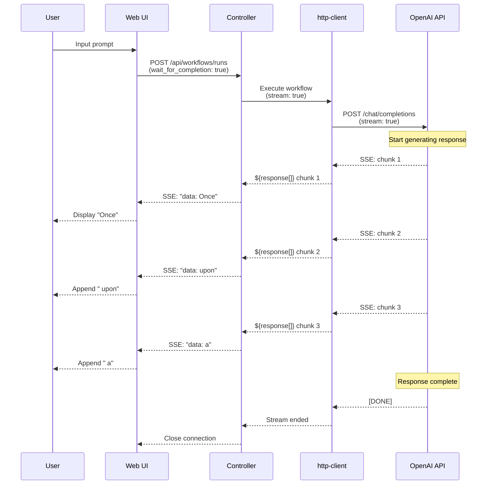
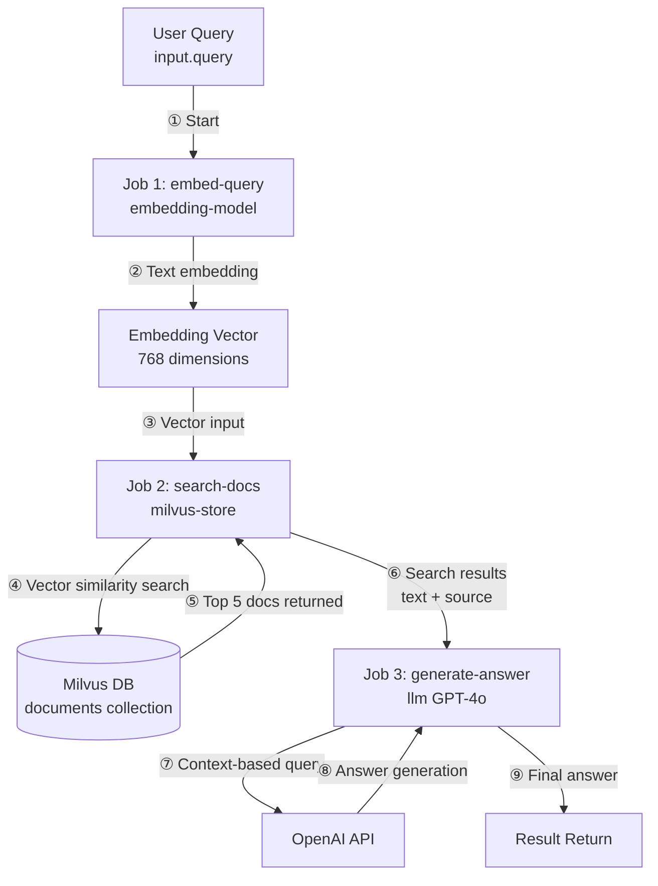
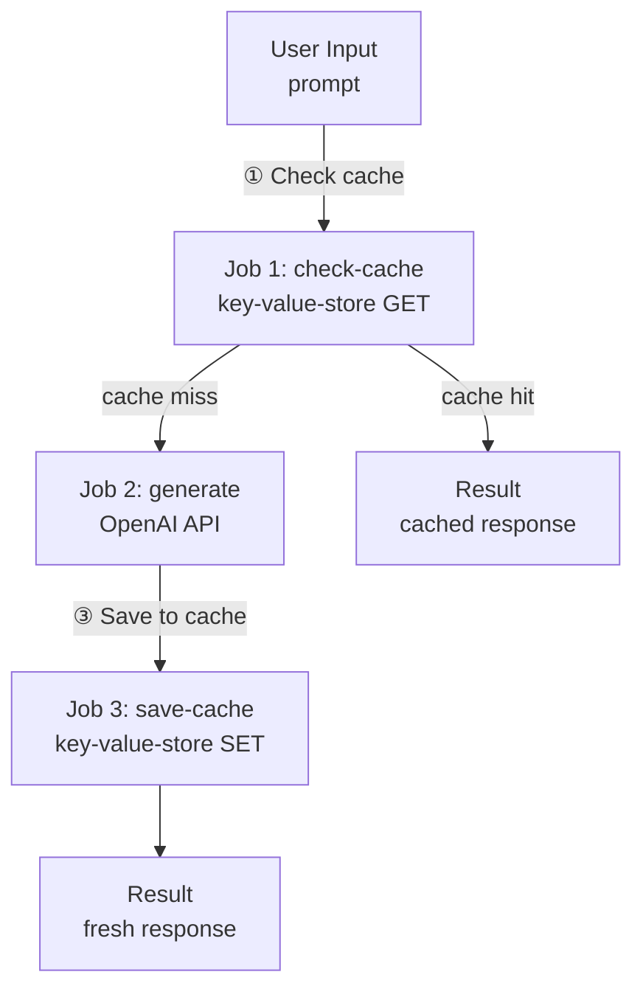
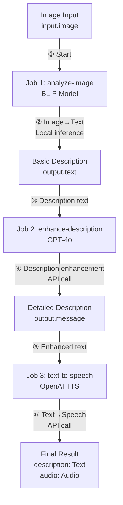
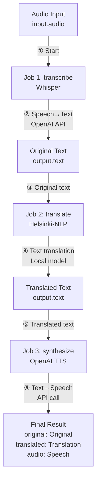
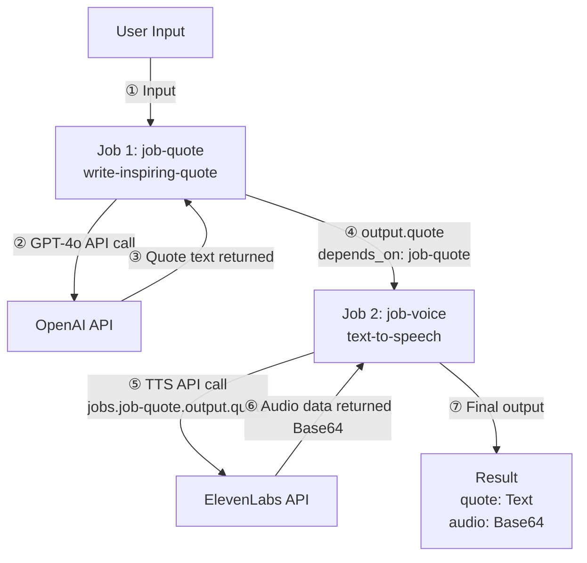
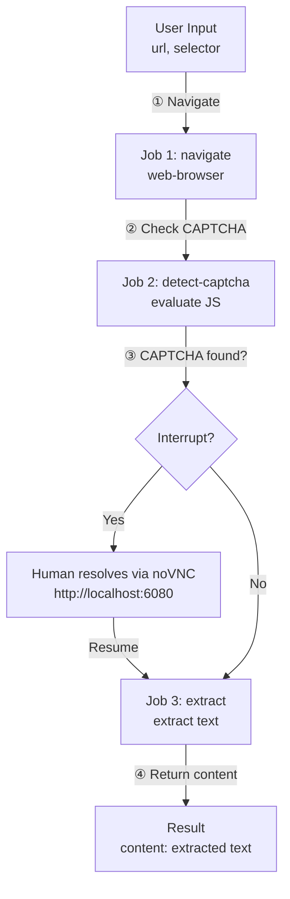
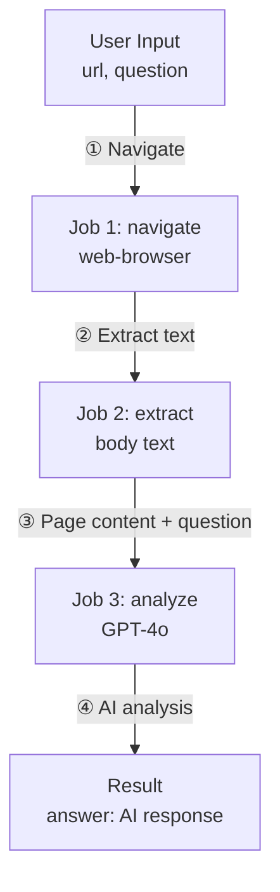

# 17. Practical Examples

This chapter provides step-by-step explanations of real-world use cases using model-compose. Each example includes complete configuration and execution instructions.

---

## 17.1 Building a Chatbot

### 17.1.1 OpenAI GPT-4o Chatbot

**Goal**: Build a simple conversational chatbot using OpenAI GPT-4o

**Configuration File** (`model-compose.yml`):

```yaml
controller:
  type: http-server
  port: 8080
  base_path: /api
  webui:
    driver: gradio
    port: 8081

workflow:
  title: Chat with OpenAI GPT-4o
  description: Generate text responses using OpenAI's GPT-4o
  input: ${input}
  output: ${output}

component:
  type: http-client
  base_url: https://api.openai.com/v1
  action:
    path: /chat/completions
    method: POST
    headers:
      Authorization: Bearer ${env.OPENAI_API_KEY}
      Content-Type: application/json
    body:
      model: gpt-4o
      messages:
        - role: user
          content: ${input.prompt as text}
      temperature: ${input.temperature as number | 0.7}
    output:
      message: ${response.choices[0].message.content}
```

**Environment Variables** (`.env`):

```bash
OPENAI_API_KEY=sk-...
```

**How to Run**:

```bash
# Start controller
model-compose up

# Access Web UI
# http://localhost:8081
```

**Key Features**:
- Automatic Gradio Web UI generation
- Adjustable temperature parameter
- Real-time response display

**Architecture Diagram**:



### 17.1.2 Streaming Chatbot

**Goal**: Build a streaming chatbot with real-time typing effect

**Configuration File**:

```yaml
controller:
  type: http-server
  port: 8080
  webui:
    driver: gradio
    port: 8081

workflow:
  title: Streaming Chat
  output: ${output as sse-text}

component:
  type: http-client
  base_url: https://api.openai.com/v1
  action:
    path: /chat/completions
    method: POST
    headers:
      Authorization: Bearer ${env.OPENAI_API_KEY}
    body:
      model: gpt-4o
      messages:
        - role: user
          content: ${input.prompt as text}
      stream: true
    stream_format: json
    output: ${response[].choices[0].delta.content}
```

**Features**:
- Real-time streaming using SSE protocol
- Automatic typing effect in Gradio
- Immediate feedback for long responses

**Streaming Flow Diagram**:



---

## 17.2 RAG System (Using Vector DB)

### 17.2.1 Text Embedding Search with ChromaDB

**Goal**: Generate text embeddings, store in ChromaDB, and perform similarity search

**Configuration File**:

```yaml
controller:
  type: http-server
  port: 8080
  base_path: /api
  webui:
    driver: gradio
    port: 8081

workflows:
  - id: insert-sentence-embedding
    title: Insert Text Embedding
    description: Generate text embedding and insert it into ChromaDB vector store
    jobs:
      - id: embedding-sentence
        component: embedding-model
        input: ${input}
        output: ${output}

      - id: insert-embedding
        component: vector-store
        action: insert
        input:
          vector: ${jobs.embedding-sentence.output}
          metadata: ${input}
        output: ${output as json}
        depends_on: [ embedding-sentence ]

  - id: search-sentence-embeddings
    title: Search Similar Embeddings
    description: Generate query embedding and search for similar vectors in ChromaDB
    jobs:
      - id: embedding-sentence
        component: embedding-model
        input: ${input}
        output: ${output}

      - id: search-embeddings
        component: vector-store
        action: search
        input:
          vector: ${jobs.embedding-sentence.output}
        output: ${output as object[]/id,score,metadata.text}
        depends_on: [ embedding-sentence ]

  - id: delete-sentence-embedding
    title: Delete Text Embedding
    description: Remove a specific vector from the ChromaDB collection
    component: vector-store
    action: delete
    input: ${input}
    output: ${output as json}

components:
  - id: vector-store
    type: vector-store
    driver: chroma
    actions:
      - id: insert
        collection: test
        method: insert
        vector: ${input.vector}
        metadata: ${input.metadata}

      - id: search
        collection: test
        method: search
        query: ${input.vector}
        output_fields: [ text ]

      - id: delete
        collection: test
        method: delete
        vector_id: ${input.vector_id}

  - id: embedding-model
    type: model
    task: text-embedding
    model: sentence-transformers/all-MiniLM-L6-v2
    action:
      text: ${input.text}
```

**API Usage Examples**:

```bash
# 1. Insert text
curl -X POST http://localhost:8080/api/workflows/insert-sentence-embedding/runs \
  -H "Content-Type: application/json" \
  -d '{"input": {"text": "model-compose is a declarative AI orchestrator"}}'

# 2. Search similar text
curl -X POST http://localhost:8080/api/workflows/search-sentence-embeddings/runs \
  -H "Content-Type: application/json" \
  -d '{"input": {"text": "AI workflow tool"}}'

# 3. Delete
curl -X POST http://localhost:8080/api/workflows/delete-sentence-embedding/runs \
  -H "Content-Type: application/json" \
  -d '{"input": {"vector_id": "id123"}}'
```

### 17.2.2 RAG System with Milvus

**Goal**: High-performance RAG system using Milvus vector database

**Configuration File**:

```yaml
controller:
  type: http-server
  port: 8080

workflows:
  - id: rag-query
    title: RAG Query
    description: Retrieve relevant documents and generate answer
    jobs:
      - id: embed-query
        component: embedding-model
        input:
          text: ${input.query}
        output: ${output}

      - id: search-docs
        component: milvus-store
        action: search
        input:
          vector: ${jobs.embed-query.output}
        output: ${output}
        depends_on: [ embed-query ]

      - id: generate-answer
        component: llm
        input:
          context: ${jobs.search-docs.output}
          query: ${input.query}
        output: ${output}
        depends_on: [ search-docs ]

components:
  - id: embedding-model
    type: model
    task: text-embedding
    model: sentence-transformers/all-MiniLM-L6-v2
    action:
      text: ${input.text}

  - id: milvus-store
    type: vector-store
    driver: milvus
    host: localhost
    port: 19530
    actions:
      - id: search
        collection: documents
        method: search
        query: ${input.vector}
        top_k: 5
        output_fields: [ text, source ]

  - id: llm
    type: http-client
    base_url: https://api.openai.com/v1
    action:
      path: /chat/completions
      method: POST
      headers:
        Authorization: Bearer ${env.OPENAI_API_KEY}
      body:
        model: gpt-4o
        messages:
          - role: system
            content: Answer based on the following context: ${input.context}
          - role: user
            content: ${input.query}
      output: ${response.choices[0].message.content}
```

**Features**:
- 3-stage pipeline: Embedding → Search → Generation
- Milvus high-performance vector search
- Context-based answer generation using GPT-4o

**RAG Pipeline Diagram**:



---

## 17.3 Graph Store (Knowledge Graphs & Social Networks)

### 17.3.1 Knowledge Graph with Neo4j

**Goal**: Build a knowledge graph to store people and their relationships, then traverse connections

**Configuration File** (`model-compose.yml`):

```yaml
controller:
  adapter:
    type: http-server
    port: 8080
    base_path: /api
  webui:
    driver: gradio
    port: 8081

workflows:
  - id: add-person
    title: Add Person
    description: Add a person node to the knowledge graph
    jobs:
      - id: insert-node
        component: knowledge-graph
        action: add-person
        input: ${input}
        output: ${output as json}

  - id: add-friendship
    title: Add Friendship
    description: Create a KNOWS relationship between two people
    jobs:
      - id: insert-rel
        component: knowledge-graph
        action: add-relationship
        input: ${input}
        output: ${output as json}

  - id: find-connections
    title: Find Connections
    description: Traverse the graph to find connected people
    jobs:
      - id: traverse
        component: knowledge-graph
        action: find-connections
        input: ${input}
        output: ${output as json}

components:
  - id: knowledge-graph
    type: graph-store
    driver: neo4j
    url: bolt://localhost:7687
    username: neo4j
    password: password
    actions:
      - id: add-person
        method: insert
        nodes:
          label: Person
          properties:
            name: ${input.name}
            age: ${input.age}

      - id: add-relationship
        method: insert
        relationships:
          type: KNOWS
          from: ${input.from_id}
          to: ${input.to_id}
          properties:
            since: ${input.since}

      - id: find-person
        method: query
        query: "MATCH (p:Person {name: $name}) RETURN p"
        params:
          name: ${input.name}

      - id: find-connections
        method: traverse
        start_node: ${input.node_id}
        direction: both
        max_depth: 2
        relationship_types: [KNOWS]
```

**Prerequisites**:
- Neo4j running locally (`docker run -p 7687:7687 -e NEO4J_AUTH=neo4j/password neo4j`)

**Running**:

```bash
# Start the service
model-compose up

# Add people
curl -X POST http://localhost:8080/api/workflows/add-person/run \
  -H 'Content-Type: application/json' \
  -d '{"input": {"name": "Alice", "age": 30}}'

# Create a friendship
curl -X POST http://localhost:8080/api/workflows/add-friendship/run \
  -H 'Content-Type: application/json' \
  -d '{"input": {"from_id": "<alice_node_id>", "to_id": "<bob_node_id>", "since": 2020}}'

# Find connections
curl -X POST http://localhost:8080/api/workflows/find-connections/run \
  -H 'Content-Type: application/json' \
  -d '{"input": {"node_id": "<alice_node_id>"}}'
```

**Key Points**:
- `method: insert` with `nodes` creates graph nodes; with `relationships` creates edges
- `method: traverse` discovers connected nodes up to `max_depth` hops away
- `method: query` executes raw Cypher for full flexibility
- `detach: true` (default) on delete ensures connected relationships are also removed
- Node IDs are returned by Neo4j in `elementId()` format (e.g., `4:abc:0`)

**Pipeline Diagram**:

```mermaid
graph TD
    A[User Input<br/>name, age] -->|① Insert| B[Job: add-person<br/>CREATE &#40;:Person&#41;]
    B --> C[Node ID returned]
    D[User Input<br/>from_id, to_id] -->|② Connect| E[Job: add-relationship<br/>CREATE -[:KNOWS]->]
    F[User Input<br/>node_id] -->|③ Traverse| G[Job: find-connections<br/>MATCH path *1..2]
    G --> H[Connected Nodes]
```

### 17.3.2 Social Graph with ArangoDB

**Goal**: Build a social network graph and find mutual friends using ArangoDB

```yaml
components:
  - id: social-graph
    type: graph-store
    driver: arangodb
    host: localhost
    port: 8529
    username: root
    password: password
    database: social
    actions:
      - id: add-person
        method: insert
        collection: persons
        nodes:
          label: persons
          properties:
            name: ${input.name}
            age: ${input.age}

      - id: add-friendship
        method: insert
        edge_collection: friendships
        graph: social_graph
        relationships:
          type: friendships
          from: ${input.from_id}
          to: ${input.to_id}

      - id: mutual-friends
        method: query
        query: |
          FOR f1 IN OUTBOUND @person1 friendships
            FOR f2 IN OUTBOUND @person2 friendships
              FILTER f1._id == f2._id
              RETURN f1
        params:
          person1: ${input.person1_id}
          person2: ${input.person2_id}

      - id: find-network
        method: traverse
        start_node: ${input.person_id}
        graph: social_graph
        direction: both
        max_depth: 3
```

**Key Points**:
- ArangoDB uses `collection/key` format for document IDs (e.g., `persons/12345`)
- Named graphs (`graph: social_graph`) must be created in ArangoDB beforehand
- AQL queries use `@param` syntax for parameter binding
- Traversal maps `out`→`outbound`, `in`→`inbound`, `both`→`any` internally

---

## 17.4 Key-Value Store (Caching & Sessions)

### 17.4.1 API Response Caching

**Goal**: Cache LLM API responses in Redis to avoid duplicate calls for identical prompts

**Configuration File** (`model-compose.yml`):

```yaml
controller:
  adapter:
    type: http-server
    port: 8080

workflows:
  - id: cached-chat
    title: Cached Chat
    jobs:
      - id: check-cache
        component: cache
        action: get-response
        input:
          prompt: ${input.prompt}

      - id: generate
        component: openai
        condition: ${jobs.check-cache.output.cached == null}
        input:
          prompt: ${input.prompt}

      - id: save-cache
        component: cache
        action: set-response
        condition: ${jobs.check-cache.output.cached == null}
        input:
          prompt: ${input.prompt}
          response: ${jobs.generate.output.message}
    output:
      message: ${jobs.check-cache.output.cached ?? jobs.generate.output.message}

components:
  - id: cache
    type: key-value-store
    driver: redis
    host: localhost
    port: 6379
    actions:
      - id: get-response
        method: get
        key: "chat:${input.prompt}"
        output:
          cached: ${result.value}
      - id: set-response
        method: set
        key: "chat:${input.prompt}"
        value: ${input.response}
        ttl: 3600

  - id: openai
    type: http-client
    base_url: https://api.openai.com/v1
    action:
      path: /chat/completions
      method: POST
      headers:
        Authorization: Bearer ${env.OPENAI_API_KEY}
      body:
        model: gpt-4o
        messages:
          - role: user
            content: ${input.prompt as text}
      output:
        message: ${response.choices[0].message.content}
```

**API Usage**:

```bash
# First call - generates and caches
curl -X POST http://localhost:8080/workflows/runs \
  -H "Content-Type: application/json" \
  -d '{"workflow_id": "cached-chat", "input": {"prompt": "What is Redis?"}}'

# Second call with same prompt - returns cached result instantly
curl -X POST http://localhost:8080/workflows/runs \
  -H "Content-Type: application/json" \
  -d '{"workflow_id": "cached-chat", "input": {"prompt": "What is Redis?"}}'
```

**Pipeline Diagram**:



### 17.4.2 Session Management

**Goal**: Store user session data with automatic expiration

```yaml
components:
  - id: session
    type: key-value-store
    driver: redis
    url: redis://localhost:6379/1
    actions:
      - id: save
        method: set
        key: "session:${input.user_id}"
        value:
          history: ${input.history}
          preferences: ${input.preferences}
        ttl: 86400

      - id: load
        method: get
        key: "session:${input.user_id}"
        output:
          session: ${result.value}

      - id: logout
        method: delete
        key: "session:${input.user_id}"
```

**Key Points**:
- TTL of 86400 seconds (24 hours) automatically expires sessions
- Complex objects (dict, list) are serialized as JSON and deserialized on retrieval
- `url` and `host`/`port` are mutually exclusive connection options

---

## 17.5 Multimodal Workflows

### 17.5.1 Image → Text → Speech Pipeline

**Goal**: Analyze image, generate description, and convert to speech

**Configuration File**:

```yaml
controller:
  type: http-server
  port: 8080
  webui:
    driver: gradio
    port: 8081

workflow:
  title: Image to Speech Pipeline
  description: Analyze image, generate description, and convert to speech
  jobs:
    - id: analyze-image
      component: image-analyzer
      input:
        image: ${input.image}
      output: ${output}

    - id: enhance-description
      component: gpt4o
      input:
        prompt: |
          Make this image description more engaging and detailed:
          ${jobs.analyze-image.output.text}
      output: ${output}
      depends_on: [ analyze-image ]

    - id: text-to-speech
      component: tts
      input:
        text: ${jobs.enhance-description.output.message}
      output:
        description: ${jobs.enhance-description.output.message}
        audio: ${output as audio}
      depends_on: [ enhance-description ]

components:
  - id: image-analyzer
    type: model
    task: image-to-text
    model: Salesforce/blip-image-captioning-large
    action:
      image: ${input.image as image}
      output:
        text: ${result}

  - id: gpt4o
    type: http-client
    base_url: https://api.openai.com/v1
    action:
      path: /chat/completions
      method: POST
      headers:
        Authorization: Bearer ${env.OPENAI_API_KEY}
      body:
        model: gpt-4o
        messages:
          - role: user
            content: ${input.prompt}
      output:
        message: ${response.choices[0].message.content}

  - id: tts
    type: http-client
    action:
      endpoint: https://api.openai.com/v1/audio/speech
      method: POST
      headers:
        Authorization: Bearer ${env.OPENAI_API_KEY}
      body:
        model: tts-1
        input: ${input.text}
        voice: nova
      output: ${response}
```

**3-Stage Pipeline**:
1. **Image Analysis**: BLIP model generates image description
2. **Text Enhancement**: GPT-4o rewrites description to be more detailed and engaging
3. **Speech Conversion**: OpenAI TTS converts text to speech

**Multimodal Pipeline Diagram**:



### 17.5.2 Speech → Text → Translation → Speech Pipeline

**Goal**: Translate spoken language to another language with speech output

**Configuration File**:

```yaml
controller:
  type: http-server
  port: 8080
  webui:
    driver: gradio
    port: 8081

workflow:
  title: Voice Translation Pipeline
  description: Transcribe audio, translate to target language, and synthesize speech
  jobs:
    - id: transcribe
      component: whisper
      input:
        audio: ${input.audio}
      output: ${output}

    - id: translate
      component: translator
      input:
        text: ${jobs.transcribe.output.text}
        target_lang: ${input.target_lang}
      output: ${output}
      depends_on: [ transcribe ]

    - id: synthesize
      component: tts
      input:
        text: ${jobs.translate.output.text}
      output:
        original: ${jobs.transcribe.output.text}
        translated: ${jobs.translate.output.text}
        audio: ${output as audio}
      depends_on: [ translate ]

components:
  - id: whisper
    type: http-client
    action:
      endpoint: https://api.openai.com/v1/audio/transcriptions
      method: POST
      headers:
        Authorization: Bearer ${env.OPENAI_API_KEY}
      body:
        file: ${input.audio as audio}
        model: whisper-1
      output:
        text: ${response.text}

  - id: translator
    type: model
    task: translation
    model: Helsinki-NLP/opus-mt-en-ko
    action:
      text: ${input.text as text}
      output:
        text: ${result}

  - id: tts
    type: http-client
    action:
      endpoint: https://api.openai.com/v1/audio/speech
      method: POST
      headers:
        Authorization: Bearer ${env.OPENAI_API_KEY}
      body:
        model: tts-1
        input: ${input.text}
        voice: nova
      output: ${response}
```

**4-Stage Pipeline**:
1. **Speech Recognition**: Whisper converts speech to text
2. **Translation**: Helsinki-NLP model translates text
3. **Speech Synthesis**: OpenAI TTS converts translated text to speech
4. **Output**: Original text, translated text, and translated audio

**Voice Translation Pipeline Diagram**:



---

## 17.6 Voice Generation Pipeline

### 17.6.1 Text-to-Speech (OpenAI TTS)

**Goal**: Convert text to speech using OpenAI TTS API

**Configuration File**:

```yaml
controller:
  type: http-server
  port: 8080
  base_path: /api
  webui:
    driver: gradio
    port: 8081

workflow:
  title: Generate Speech with OpenAI TTS
  description: Convert input text into natural-sounding speech using OpenAI's TTS models.
  jobs:
    - id: speak
      component: openai-text-to-speech
      input: ${input}
      output: ${output as audio}

components:
  - id: openai-text-to-speech
    type: http-client
    action:
      endpoint: https://api.openai.com/v1/audio/speech
      method: POST
      headers:
        Authorization: Bearer ${env.OPENAI_API_KEY}
        Content-Type: application/json
      body:
        model: ${input.model as select/tts-1,tts-1-hd,gpt-4o-mini-tts | tts-1}
        input: ${input.text}
        voice: ${input.voice as select/alloy,ash,ballad,coral,echo,fable,onyx,nova,sage,shimmer,verse | nova}
        response_format: mp3
      output: ${response}
```

**Supported Voices**:
- `alloy`, `ash`, `ballad`, `coral`, `echo`, `fable`
- `onyx`, `nova`, `sage`, `shimmer`, `verse`

**Supported Models**:
- `tts-1`: Fast response
- `tts-1-hd`: High-quality audio
- `gpt-4o-mini-tts`: Latest model

### 17.6.2 Inspiring Quote Voice Generation

**Goal**: Generate motivational quotes with GPT-4o and convert to speech with ElevenLabs TTS

**Configuration File**:

```yaml
controller:
  type: http-server
  port: 8080
  base_path: /api
  webui:
    driver: gradio
    port: 8081

workflow:
  title: Inspire with Voice
  description: Generate a motivational quote using GPT-4o and bring it to life by converting it into natural speech with ElevenLabs TTS.
  jobs:
    - id: job-quote
      component: write-inspiring-quote
      input: ${input}
      output: ${output}

    - id: job-voice
      component: text-to-speech
      input:
        text: ${jobs.job-quote.output.quote}
        voice_id: ${input.voice_id | JBFqnCBsd6RMkjVDRZzb}
      output:
        quote: ${jobs.job-quote.output.quote}
        audio: ${output as audio/mp3;base64}
      depends_on: [ job-quote ]

components:
  - id: write-inspiring-quote
    type: http-client
    base_url: https://api.openai.com/v1
    action:
      path: /chat/completions
      method: POST
      headers:
        Authorization: Bearer ${env.OPENAI_API_KEY}
        Content-Type: application/json
      body:
        model: gpt-4o
        messages:
          - role: user
            content: |
              Write an inspiring quote similar to the example below.
              Don't say anything else—just give me the quote.
              Aim for around 30 words.
              Example – Never give up. If there's something you want to become, be proud of it. Give yourself a chance.
              Don't think you're worthless—there's nothing to gain from that. Aim high. That's how life should be lived.
      output:
        quote: ${response.choices[0].message.content}

  - id: text-to-speech
    type: http-client
    action:
      endpoint: https://api.elevenlabs.io/v1/text-to-speech/${input.voice_id}?output_format=mp3_44100_128
      method: POST
      headers:
        Content-Type: application/json
        xi-api-key: ${env.ELEVENLABS_API_KEY}
      body:
        text: ${input.text}
        model_id: eleven_multilingual_v2
      output: ${response as base64}
```

**Environment Variables**:

```bash
OPENAI_API_KEY=sk-...
ELEVENLABS_API_KEY=...
```

**Workflow Description**:
1. GPT-4o generates an inspiring quote
2. ElevenLabs API converts quote to speech
3. Web UI displays both text and audio

**Workflow Diagram**:



---

## 17.7 Image Analysis and Editing

### 17.7.1 Image Captioning (Image-to-Text)

**Goal**: Generate image descriptions using a local Vision model

**Configuration File**:

```yaml
controller:
  type: http-server
  port: 8080
  base_path: /api
  webui:
    driver: gradio
    port: 8081

workflow:
  title: Generate Text from Image
  description: Generate text based on a given image using a pretrained vision model.
  input: ${input}
  output:
    generated: ${output}

component:
  type: model
  task: image-to-text
  model: Salesforce/blip-image-captioning-large
  architecture: blip
  action:
    image: ${input.image as image}
    prompt: ${input.prompt as text}
```

**Execution Example**:

```bash
# Run workflow
model-compose run default --input '{"image": "path/to/image.jpg", "prompt": "Describe this image"}'
```

**Supported Models**:
- `Salesforce/blip-image-captioning-large`
- `Salesforce/blip-image-captioning-base`
- `nlpconnect/vit-gpt2-image-captioning`

### 17.7.2 Image Editing (OpenAI DALL-E)

**Goal**: Edit images using OpenAI DALL-E

**Configuration File**:

```yaml
controller:
  type: http-server
  port: 8080
  webui:
    driver: gradio
    port: 8081

workflow:
  title: Edit Image with DALL-E
  description: Edit an existing image using OpenAI's DALL-E API
  component: dalle-edit
  input: ${input}
  output: ${output as image}

component:
  id: dalle-edit
  type: http-client
  action:
    endpoint: https://api.openai.com/v1/images/edits
    method: POST
    headers:
      Authorization: Bearer ${env.OPENAI_API_KEY}
    body:
      image: ${input.image as image}
      mask: ${input.mask as image}
      prompt: ${input.prompt as text}
      n: ${input.n as integer | 1}
      size: ${input.size as select/256x256,512x512,1024x1024 | 1024x1024}
    output: ${response.data[0].url}
```

**Use Cases**:
- Change image backgrounds
- Modify specific regions
- Style transfer

---

## 17.8 Browser Automation

### 17.8.1 Web Scraping with CAPTCHA Fallback

**Goal**: Navigate to a page, detect CAPTCHAs, pause for human resolution via noVNC, then extract content

**Prerequisites**:

Start a headless Chrome with noVNC:

```bash
docker run -d -p 9222:9222 -p 6080:6080 \
  chromedp/headless-shell:latest
```

**Configuration File**:

```yaml
controller:
  type: http-server
  port: 8080
  webui:
    driver: gradio
    port: 8081

workflows:
  - id: scrape-with-fallback
    title: Scrape with CAPTCHA Fallback
    input:
      - id: url
        type: string
        description: Target URL to scrape
      - id: selector
        type: string
        description: CSS selector for content extraction
    jobs:
      - id: navigate
        component: browser
        action: navigate
        input:
          url: ${input.url}

      - id: detect-captcha
        component: browser
        action: check-captcha
        interrupt:
          after:
            condition:
              operator: eq
              input: ${output}
              value: true
            message: >
              CAPTCHA detected! Please solve it via noVNC at:
              http://localhost:6080/vnc.html
        depends_on: [ navigate ]

      - id: extract
        component: browser
        action: extract-text
        input:
          selector: ${input.selector}
        depends_on: [ detect-captcha ]
        output:
          content: "${output as text}"

components:
  - id: browser
    type: web-browser
    host: localhost
    port: 9222
    timeout: 30s
    actions:
      - id: navigate
        method: navigate
        url: "${input.url}"
        wait_until: networkidle

      - id: check-captcha
        method: evaluate
        expression: >
          !!(document.querySelector('[id*=captcha],[class*=captcha]')
            || document.querySelector('iframe[src*=captcha]')
            || document.querySelector('#cf-challenge-running'))

      - id: extract-text
        method: extract
        selector: "${input.selector}"
        extract_mode: text
```

**Workflow**:
1. Navigate to the target URL
2. Evaluate JavaScript to detect CAPTCHA elements
3. If CAPTCHA found, workflow interrupts and shows noVNC URL for human resolution
4. After human resolves CAPTCHA, workflow resumes and extracts content

**Workflow Diagram**:



### 17.8.2 Login and Scrape Protected Content

**Goal**: Automate login to a website and extract protected content

**Configuration File**:

```yaml
controller:
  type: http-server
  port: 8080
  webui:
    driver: gradio
    port: 8081

workflows:
  - id: login-and-scrape
    title: Login then Scrape
    input:
      - id: login_url
        type: string
      - id: username
        type: string
      - id: password
        type: string
      - id: content_url
        type: string
      - id: selector
        type: string
    jobs:
      - id: open-login
        component: browser
        action: navigate
        input:
          url: ${input.login_url}

      - id: fill-username
        component: browser
        action: type-text
        input:
          selector: "input[name='username']"
          text: ${input.username}
        depends_on: [ open-login ]

      - id: fill-password
        component: browser
        action: type-text
        input:
          selector: "input[name='password']"
          text: ${input.password}
        depends_on: [ fill-username ]

      - id: submit
        component: browser
        action: click
        input:
          selector: "button[type='submit']"
        depends_on: [ fill-password ]

      - id: navigate-content
        component: browser
        action: navigate
        input:
          url: ${input.content_url}
        depends_on: [ submit ]

      - id: extract-content
        component: browser
        action: extract-text
        input:
          selector: ${input.selector}
        depends_on: [ navigate-content ]
        output:
          content: ${output as text}

components:
  - id: browser
    type: web-browser
    host: localhost
    port: 9222
    timeout: 30s
    actions:
      - id: navigate
        method: navigate
        url: "${input.url}"
        wait_until: networkidle

      - id: type-text
        method: input-text
        selector: "${input.selector}"
        text: "${input.text}"

      - id: click
        method: click
        selector: "${input.selector}"

      - id: extract-text
        method: extract
        selector: "${input.selector}"
        extract_mode: text
```

**6-Step Pipeline**:
1. Navigate to login page
2. Fill username field
3. Fill password field
4. Click submit button
5. Navigate to protected content page
6. Extract content with CSS selector

### 17.8.3 AI-Powered Web Content Analysis

**Goal**: Navigate to a page, extract content, and analyze it with GPT-4o

**Configuration File**:

```yaml
controller:
  type: http-server
  port: 8080
  webui:
    driver: gradio
    port: 8081

workflows:
  - id: analyze-page
    title: Analyze Web Page with AI
    input:
      - id: url
        type: string
        description: URL to analyze
      - id: question
        type: string
        description: Question to ask about the page content
    jobs:
      - id: navigate
        component: browser
        action: navigate
        input:
          url: ${input.url}

      - id: extract
        component: browser
        action: extract-body
        depends_on: [ navigate ]

      - id: analyze
        component: gpt4o
        input:
          context: ${jobs.extract.output.content}
          question: ${input.question}
        depends_on: [ extract ]
        output:
          answer: ${output.message}

components:
  - id: browser
    type: web-browser
    host: localhost
    port: 9222
    timeout: 30s
    actions:
      - id: navigate
        method: navigate
        url: "${input.url}"
        wait_until: networkidle

      - id: extract-body
        method: extract
        selector: "body"
        extract_mode: text
        output:
          content: ${result}

  - id: gpt4o
    type: http-client
    base_url: https://api.openai.com/v1
    action:
      path: /chat/completions
      method: POST
      headers:
        Authorization: Bearer ${env.OPENAI_API_KEY}
      body:
        model: gpt-4o
        messages:
          - role: system
            content: |
              Answer questions based on the following web page content:
              ${input.context}
          - role: user
            content: ${input.question}
      output:
        message: ${response.choices[0].message.content}
```

**3-Stage Pipeline**:
1. **Navigate**: Load the target page and wait for network idle
2. **Extract**: Pull all text content from the page body
3. **Analyze**: Send content to GPT-4o with the user's question

**Pipeline Diagram**:



---

## 17.9 Slack Bot (MCP)

### 17.9.1 Building a Slack Bot with MCP Server

**Goal**: Build a Slack bot using MCP (Model Context Protocol) server

**Configuration File**:

```yaml
controller:
  type: mcp-server
  base_path: /mcp
  port: 8080
  webui:
    driver: gradio
    port: 8081

workflows:
  - id: send-message
    title: Send Message to Slack Channel
    description: Send a text message to a specified Slack channel using the Slack Web API
    action: chat-post-message
    input:
      channel: ${input.channel | ${env.DEFAULT_SLACK_CHANNEL_ID} @(description Slack channel ID for sending a message)}
      text: ${input.message @(description Message to send to Slack)}
    output: ${output as json}

  - id: list-channels
    title: List Slack Channels
    description: Retrieve a list of all available channels in the Slack workspace
    action: conversations-list
    output: ${output as object[]}

  - id: join-channel
    title: Join Slack Channel
    description: Join a specified Slack channel for the bot user
    action: conversations-join
    input:
      channel: ${input.channel | ${env.DEFAULT_SLACK_CHANNEL_ID}}
    output: ${output as json}

component:
  type: http-client
  base_url: https://slack.com/api
  headers:
    Authorization: Bearer ${env.SLACK_APP_TOKEN}
  actions:
    - id: chat-post-message
      path: /chat.postMessage
      method: POST
      body:
        channel: ${input.channel}
        text: ${input.text}
        attachments: ${input.attachments}
      headers:
        Content-Type: application/json
      output: ${response}

    - id: conversations-list
      path: /conversations.list
      method: GET
      params:
        limit: ${input.limit as integer | 200 @(description Maximum number of channels to retrieve)}
      headers:
        Content-Type: application/x-www-form-urlencoded
      output: ${response.channels as object[]/id,name}

    - id: conversations-join
      path: /conversations.join
      method: POST
      body:
        channel: ${input.channel}
      headers:
        Content-Type: application/json
      output: ${response}
```

**Environment Variables**:

```bash
SLACK_APP_TOKEN=xoxb-...
DEFAULT_SLACK_CHANNEL_ID=C...
```

**MCP Server Features**:
- Integration with MCP clients like Claude Desktop
- Expose multiple workflows as tools
- Provide parameter descriptions using `@(description ...)` annotations

**Claude Desktop Configuration** (`claude_desktop_config.json`):

```json
{
  "mcpServers": {
    "slack-bot": {
      "command": "npx",
      "args": [
        "-y",
        "@modelcontextprotocol/server-stdio",
        "http://localhost:8080/mcp"
      ]
    }
  }
}
```

### 17.9.2 AI-Powered Slack Auto-Reply Bot

**Goal**: Build a bot that automatically responds to Slack messages using AI

**Configuration File**:

```yaml
controller:
  type: http-server
  port: 8080

listeners:
  - id: slack-events
    type: http-callback
    path: /slack/events
    method: POST
    callback:
      url: https://slack.com/api/chat.postMessage
      method: POST
      headers:
        Authorization: Bearer ${env.SLACK_BOT_TOKEN}
        Content-Type: application/json
      body:
        channel: ${webhook.event.channel}
        text: ${jobs.generate-reply.output.message}

gateway:
  type: ngrok
  port: 8080

workflow:
  title: AI Slack Reply
  jobs:
    - id: generate-reply
      component: gpt4o
      input:
        prompt: ${input.event.text}
      output: ${output}

component:
  id: gpt4o
  type: http-client
  base_url: https://api.openai.com/v1
  action:
    path: /chat/completions
    method: POST
    headers:
      Authorization: Bearer ${env.OPENAI_API_KEY}
    body:
      model: gpt-4o
      messages:
        - role: user
          content: ${input.prompt}
    output:
      message: ${response.choices[0].message.content}
```

**Workflow**:
1. Slack message event occurs
2. Workflow triggered via ngrok tunnel
3. GPT-4o generates response
4. Listener callback sends response to Slack

---

## 17.10 Chatbot with Conversation Memory

### 17.10.1 Stateful Chatbot (model-memory)

**Goal**: Build a chatbot that remembers previous conversation context across multiple turns using the `model-memory` component.

**Configuration File** (`model-compose.yml`):

```yaml
controller:
  type: http-server
  port: 8080
  base_path: /api
  webui:
    driver: gradio
    port: 8081

components:
  - id: gpt-4o
    type: http-client
    base_url: https://api.openai.com/v1
    action:
      path: /chat/completions
      method: POST
      headers:
        Authorization: Bearer ${env.OPENAI_API_KEY}
        Content-Type: application/json
      body:
        model: gpt-4o
        messages: ${input.messages}
      output: ${response.choices[0].message.content}

  - id: chat-memory
    type: model-memory
    storage:
      driver: sqlite
      path: ./memory.db
    window: 20
    summary:
      component: gpt-4o
      input:
        messages: ${messages}
      instruction: "Summarize the following conversation concisely:"
    actions:
      - id: load
        method: load
      - id: save
        method: save

workflows:
  - id: chat
    title: Chatbot with Memory
    description: A chatbot that remembers conversation history
    jobs:
      - id: load-memory
        component: chat-memory
        action: load
        input:
          session_id: ${input.session_id | default-session}

      - id: generate
        component: gpt-4o
        input:
          messages:
            - role: system
              content: You are a helpful assistant.
            - role: system
              content: "Previous conversation summary: ${jobs.load-memory.output.summary}"
            - ...${jobs.load-memory.output.messages}
            - role: user
              content: ${input.message as text}
        depends_on: [load-memory]

      - id: save-memory
        component: chat-memory
        action: save
        input:
          session_id: ${input.session_id | default-session}
          messages:
            - role: user
              content: ${input.message}
            - role: assistant
              content: ${jobs.generate.output}
        depends_on: [generate]
    output: ${jobs.generate.output}
```

**Environment Variables** (`.env`):

```bash
OPENAI_API_KEY=sk-...
```

**How to Run**:

```bash
# Start controller
model-compose up

# Test via CLI
model-compose run chat --input '{"session_id": "user-1", "message": "My name is Alice"}'
model-compose run chat --input '{"session_id": "user-1", "message": "What is my name?"}'
# → The bot remembers: "Your name is Alice"
```

**Workflow**:
1. Load conversation history from SQLite storage
2. Include summary + recent messages as context for GPT-4o
3. Generate response with full conversation awareness
4. Save user message + assistant response to memory
5. Old messages beyond the window are automatically summarized

### 17.10.2 Multi-User Chat with Redis Memory

**Goal**: Production-ready multi-user chatbot using Redis for shared memory storage.

**Configuration File** (`model-compose.yml`):

```yaml
controller:
  type: http-server
  port: 8080

components:
  - id: gpt-4o
    type: http-client
    base_url: https://api.openai.com/v1
    action:
      path: /chat/completions
      method: POST
      headers:
        Authorization: Bearer ${env.OPENAI_API_KEY}
        Content-Type: application/json
      body:
        model: gpt-4o
        messages: ${input.messages}
      output: ${response.choices[0].message.content}

  - id: chat-memory
    type: model-memory
    storage:
      driver: redis
      url: ${env.REDIS_URL}
      password: ${env.REDIS_PASSWORD}
    window:
      max_turn_count: 30
      max_message_count: 100
    summary:
      component: gpt-4o
      instruction: "Provide a brief summary of this conversation:"
    actions:
      - id: load
        method: load
      - id: save
        method: save
      - id: delete
        method: delete

workflows:
  - id: chat
    jobs:
      - id: load-memory
        component: chat-memory
        action: load
        input:
          session_id: ${input.session_id}

      - id: generate
        component: gpt-4o
        input:
          messages:
            - role: system
              content: ${input.system_prompt | You are a helpful assistant.}
            - role: system
              content: "Context: ${jobs.load-memory.output.summary}"
            - ...${jobs.load-memory.output.messages}
            - role: user
              content: ${input.message as text}
        depends_on: [load-memory]

      - id: save-memory
        component: chat-memory
        action: save
        input:
          session_id: ${input.session_id}
          messages:
            - role: user
              content: ${input.message}
            - role: assistant
              content: ${jobs.generate.output}
        depends_on: [generate]
    output: ${jobs.generate.output}

  - id: clear-history
    jobs:
      - id: delete
        component: chat-memory
        action: delete
        input:
          session_id: ${input.session_id}
```

**Key Points**:
- Redis storage enables sharing memory across multiple server instances
- `max_turn_count` and `max_message_count` provide dual windowing control
- Separate `clear-history` workflow for session cleanup

---

## Next Steps

Practice:
- Run each example locally
- Modify examples to build custom workflows
- Combine multiple examples to create complex pipelines
- Deploy to production environment

---

**Next Chapter**: [18. Troubleshooting](/model-compose/user-guide/18-troubleshooting.md)
